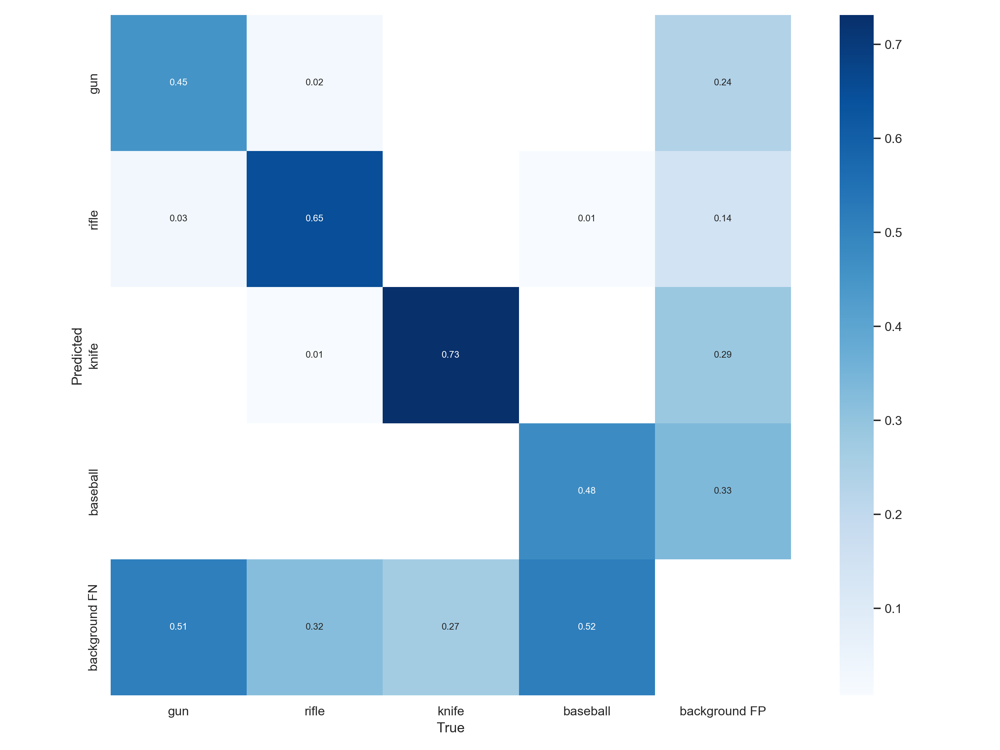
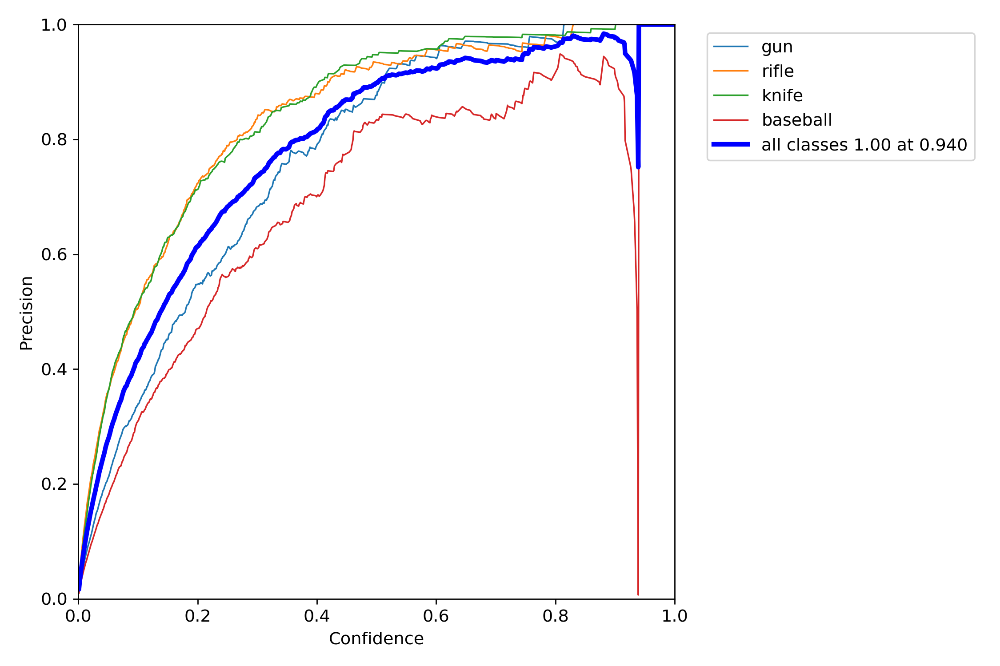
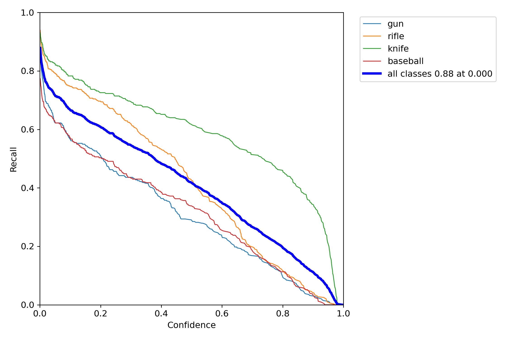
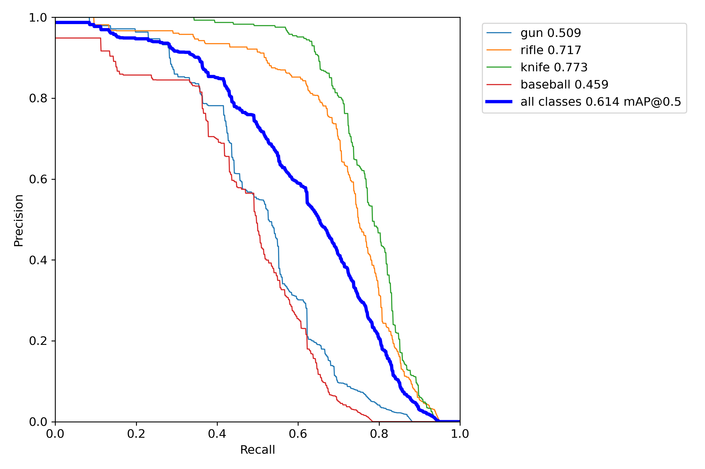
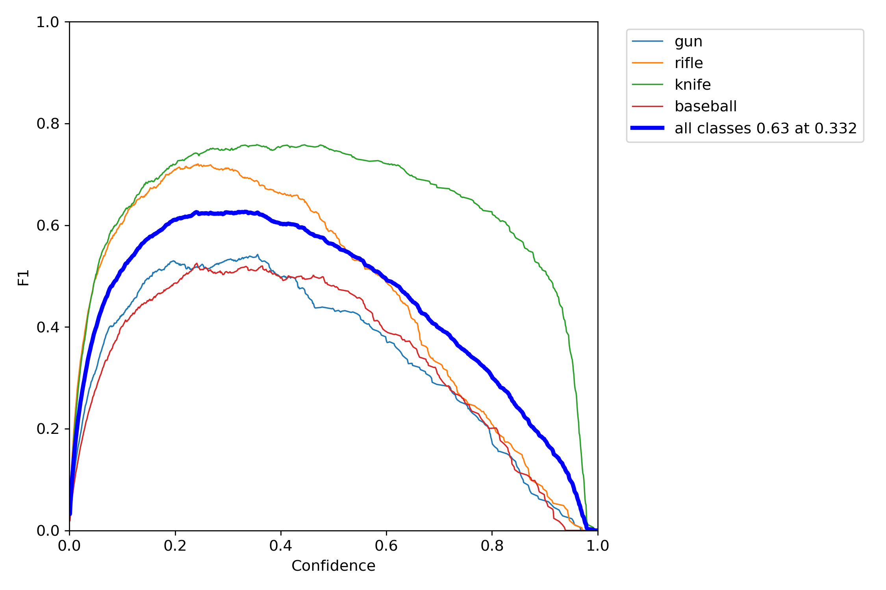
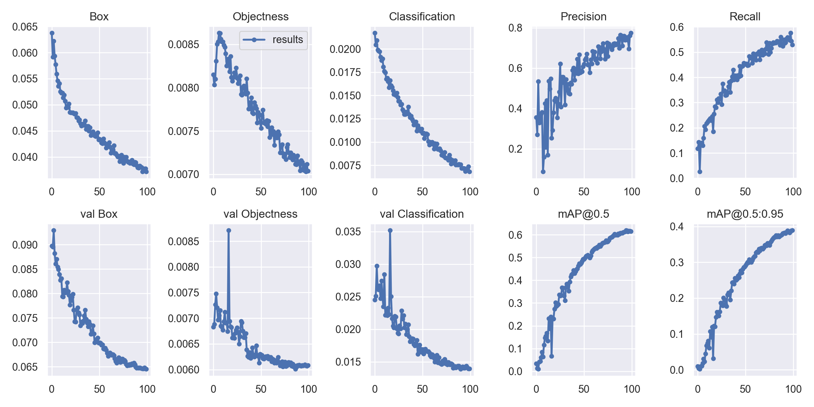
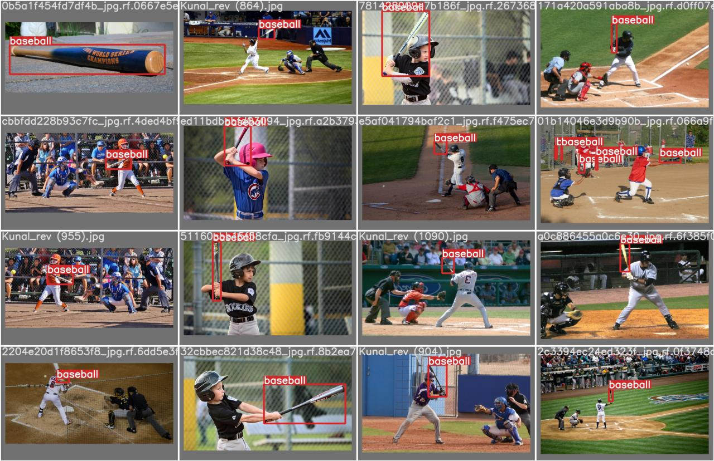
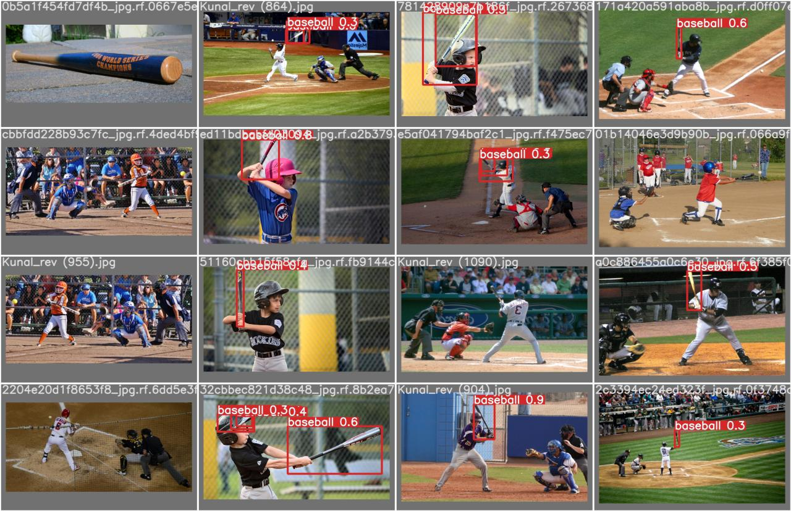

# **Weapon Detection System**

This project implements an advanced **object detection model** using **YOLOv7** to identify and classify weapons such as **guns, rifles, knives**, and other objects (e.g., baseball equipment) in real-time images and videos. It leverages PyTorch, OpenCV, and pre-trained YOLOv7 weights, with fine-tuning on a custom dataset.

---

## **Features**
- Detects **weapons** (gun, rifle, knife) and non-weapon objects.
- Real-time detection from:
  - Webcam
  - Image/Video files
  - RTSP/HTTP streams
- Visualizes bounding boxes with class labels and confidence scores.
- Tracks model metrics such as precision, recall, and F1-score.
- Generates evaluation plots:
  - Confusion matrix
  - Precision-Recall curves
  - Confidence vs Precision/Recall/F1

---

## **Sample Results**

### **Confusion Matrix**


### **Model Metrics**
- **Precision Curve**  
  
- **Recall Curve**  
  
- **Precision-Recall (PR) Curve**  
  
- **F1 Score vs Confidence**  
  

### **Training Results**


---

## **Detection Examples**
**Ground Truth vs Predictions:**
- **Labeled Test Batch**  
  
- **Predicted Test Batch**  
  

---

## **Installation**

### **Requirements**
- Python 3.8+
- PyTorch (with CUDA if GPU available)
- OpenCV
- Other dependencies in `requirements.txt`

Install dependencies:
```bash
pip install -r requirements.txt
```

---

## **Usage**

### **Run Detection**
```bash
python cam.py --output output_video.mp4 --person-weights yolov7.pt --weapon-weights best.pt --device 0 --camera 0
```

### **Parameters**
- `--output`: Output video file name
- `--person-weights`: Path to person detection weights
- `--weapon-weights`: Path to weapon detection weights  
- `--device`: GPU device (0 for first GPU, cpu for CPU)
- `--camera`: Camera index (0 for default webcam)

---

## **Project Structure**
```
weapon-detection/
├── cam.py              # Main detection script
├── detect.py           # Detection utilities
├── train.py            # Training script
├── requirements.txt    # Dependencies
├── best.pt            # Trained weapon detection weights
├── yolov7.pt          # Pre-trained YOLOv7 weights
└── runs/              # Training outputs and results
```

---

## **Training**
To train the model on your own dataset:
```bash
python train.py --data your_dataset.yaml --cfg yolov7.yaml --weights yolov7.pt --epochs 100
```

---

## **License**
This project is licensed under the MIT License.